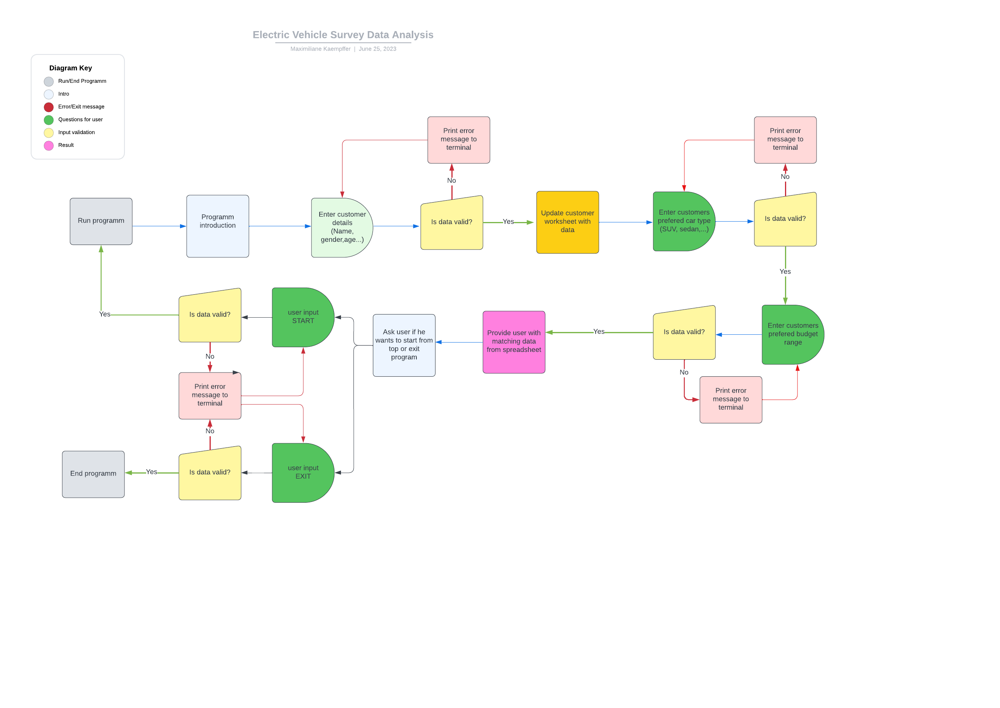
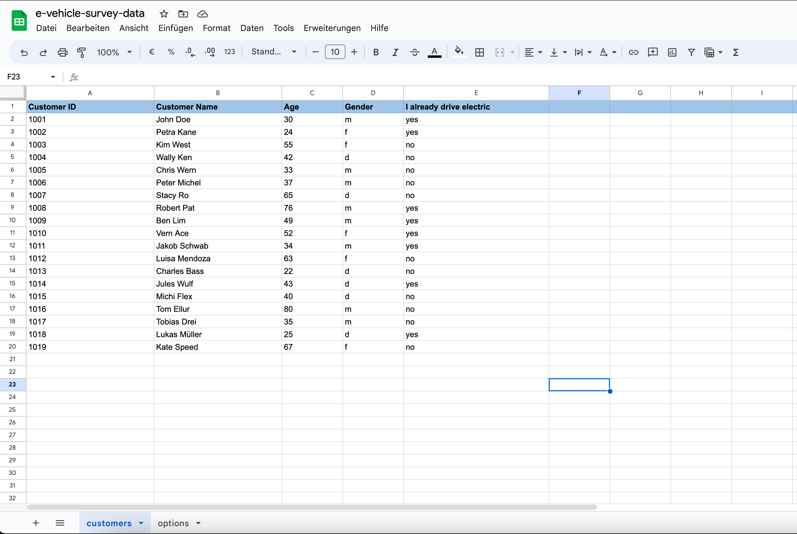
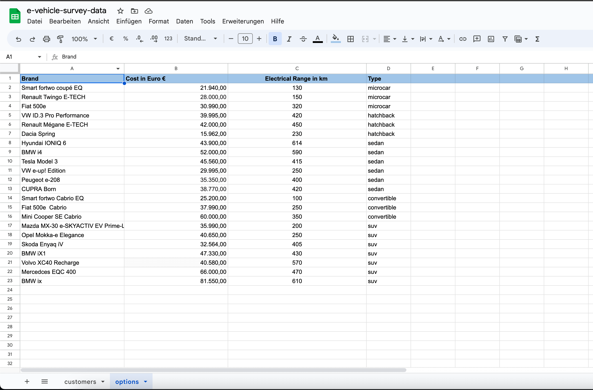

# **Electric Vehicle Picker**

## **Code Institute Portfolio Project III**
## **Story**
The idea behind the *Electric Vehicle Picker* is to create an application that can help brokers, advisors, or sales employees to find the best option for their customers. 

Based on the preferences regarding price, range, and type of car, a suitable match can be found and a recommendation can be made. 

The data given by the customer can be saved and used for further analysis. For example concerning the e-vehicle market, personal sales or marketing demographics.  

## **Contents**
* [Story](#story)
* [Scope](#scope)
* [User Experience UX](#user-experience-ux)
    * [Target audience](#target-audience)
    * [User Goals](#user-goals)
* [Flowchart](#flowchart)
* [Data Model](#data-model)
* [Features](#features)
    * [Future Features](#future-features)
* [Bugs and Challenges](#bugs-and-challenges)
* [Technologies Used](#technologies-used)
* [Deployment](#deployment)
* [Development](#development)
* [Testing](#testing)
    * [Validation](#validation)
* [Credits](#credits)
    * [Code](#code)
    * [Acknowledgments](#acknowledgments)

## **Scope**
The Scope of this project is building a command-line application with Python. Users can parse and analyze data, export results to a file, and import datasets. 

## **User Experience UX**

### **Target Audience**
The application is aimed at brokers, advisors, or sales employees of car dealerships whos jobs it is to find the matching electrical car to the preferences of their customers. 

### **User Goals**
-   As a user, I want to be welcomed to the application.
-   As a user, I want to be presented with instructions that are clear.
-   As a user, I want to understand how to insert input values.
-   As a user, I want to understand what is wrong with my input value if an error occurs.
-   As a user, I want to be able to enter the customers details.
-   As a user, I want to be able to get a selection of car types to choose from.
-   As a user, I want to be able to select one preffered car type.
-   As a user, I want to want to see the result of my selection.

## **Flowchart**
The flowchart was made using [Lucidchart](https://www.lucidchart.com/pages/landing?utm_source=google&utm_medium=cpc&utm_campaign=_chart_ol_allcountries_mixed_search_brand_exact_&km_CPC_CampaignId=12085501855&km_CPC_AdGroupID=117687297058&km_CPC_Keyword=lucid%20chart&km_CPC_MatchType=e&km_CPC_ExtensionID=&km_CPC_Network=g&km_CPC_AdPosition=&km_CPC_Creative=491660231431&km_CPC_TargetID=kwd-55720648523&km_CPC_Country=1008311&km_CPC_Device=c&km_CPC_placement=&km_CPC_target=&gclid=EAIaIQobChMInrXb5vHd_wIVWfZ3Ch37Ogt_EAAYASAAEgJKpPD_BwE).

## **Data Model**
The data is stored on the *Google Cloud platform (Google Sheets)*. This data is accessed using Python Libraries like google oauth2 and gspread. 

## **Features**
With the application being a comand-line interface based app, the focus was put on the functionality. 

### **Welcome**

- The logo features a casette with headphones and the games name *Lyrical Pop Quiz*.
- It appears in bright colors to reflect the color-sheme of the application. 
- The logo was created using [Canva](https://www.canva.com/).

### **Future Features**

## **Bugs**
All bugs are fixed, there are no bugs left to fix.

## **Technologies Used**
The language used to create this application was Python.

**Frameworks & Tools**
* [Lucidchart](https://www.lucidchart.com/pages/landing?utm_source=google&utm_medium=cpc&utm_campaign=_chart_ol_allcountries_mixed_search_brand_exact_&km_CPC_CampaignId=12085501855&km_CPC_AdGroupID=117687297058&km_CPC_Keyword=lucid%20chart&km_CPC_MatchType=e&km_CPC_ExtensionID=&km_CPC_Network=g&km_CPC_AdPosition=&km_CPC_Creative=491660231431&km_CPC_TargetID=kwd-55720648523&km_CPC_Country=1008311&km_CPC_Device=c&km_CPC_placement=&km_CPC_target=&gclid=EAIaIQobChMInrXb5vHd_wIVWfZ3Ch37Ogt_EAAYASAAEgJKpPD_BwE) was used for creating the *flowchart*. 
* [GitHub](https://github.com/join/welcome) and Git were used as host plattform and version control.
* [Codeanywhere](https://app.codeanywhere.com/) as IDE for writing and editing code.
* [Google Sheets](https://www.google.com/sheets/about/) was used for creating the databse.
* [Heroku](https://dashboard.heroku.com/apps) was used for deployment.

## **Deployment**
This application was developed in the [Codeanywhere](https://app.codeanywhere.com/) IDE and deployed on [Heroku](https://electric-vehicle-picker-aa4e1c9b3f59.herokuapp.com/).

### Deploying to Heroku:
1. Once logged or signed into [Heroku](https://dashboard.heroku.com/apps), find the *New* button and select *Create new app*.
2. Enter a *unique* app name, choose the region closest to you and select
*Create app*.
3. Go to the *Settings* tab and click on *Reveal Config Vars*.
5. For the first *Config Var* enter `CREDS` for *Key*.
6. Enter the data from your `credentials file` (e.g. creds.json) to *Value* of first *Config Var* then select *add*.
7. For the second *Config Var* set the value of *Key* to `PORT`, and the *Value* to `8000` then select *add*.
8. Go to *Add Buildpack* and select `Python` as the first dependency and `Node.js` as the second. Mind that the order of the dependencies is import.
9. Navigate to *Deploy* tab and select *Github* as *Deployed Method*.
10. Connect to your *Github* and select the *repository* that you want to deploy. 
11. Select *Enable Automatic Deploy* to rebuild your project automatically every time you push a new commit.

## **Development**
For local development the project repository can be found on [GitHub](https://github.com/join/welcome).
-	Log in or sign up to [GitHub](https://github.com/join/welcome).
-	Navigate to my GitHub profil, [Maximiliane-K](https://github.com/Maximiliane-K.).
-	Locate the repository named *“e-vehicle-picker”*.
-	Click on the green *code* button and choose HTTPS, SSH or GitHubCLI and copy the preferred link. 
-	Open the IDE of your choice and create a directory where the repository should be stored using the terminal. 
-	Enter `git clone`, paste the copied URL and press enter.
-	The repository will be cloned to the selected repository. 

## **Testing**
* Manual tests were done to check the funcionality and ensure all functions work as intended.
* All inputs were tested with different input values.
* All input validations work and provide the correct error messages to user when input values are incorrect.
* Code has been validated with CI Python Linter and no errors/warnings were found.

## **Credits**
